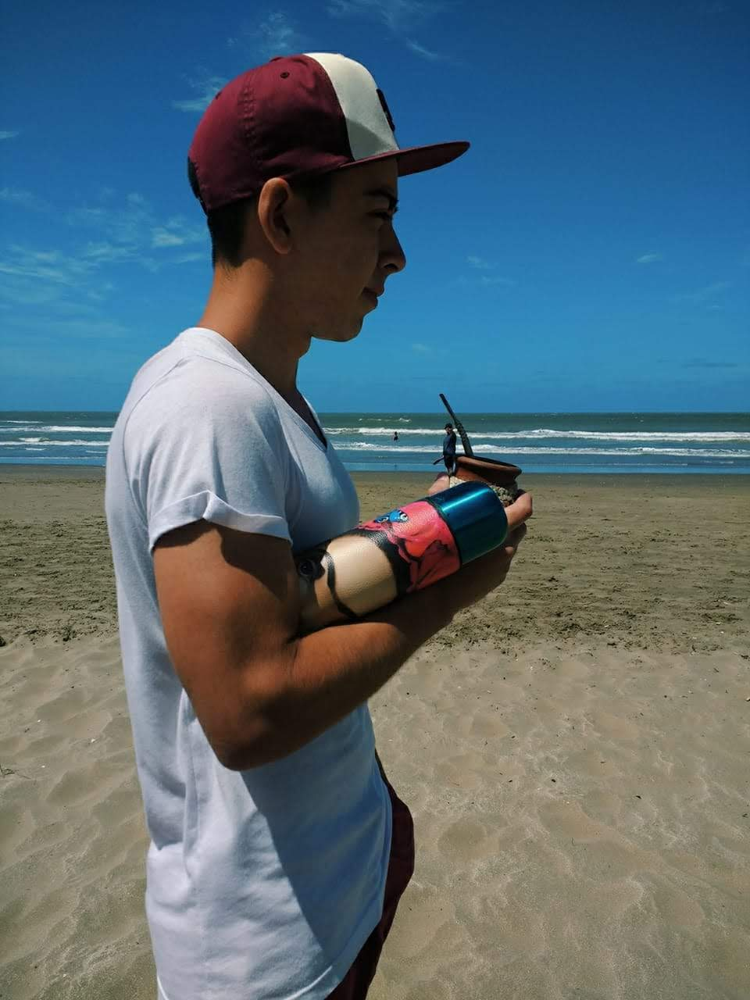

## Tomás Gerardi
### 168.577-6

Hola curso!

Mi nombre es Tomás, les cuento un poco de mi. Tengo 20 años, cursando el 2do año de la carrera. 
Vivo en la localidad de Versalles (no, no soy de Velez), soy hincha del 5to más grande, el ciclón.
Tengo dos mascotas; un perro y una gata. 
Me gusta ver películas clasicas, pero más que nada, **Marvel 4ever**. Además, me gusta entrenar, salir a comer con amigos/as, tocar la guitarra y bueno, tomar mate.

En cuanto a programación, durante el 2019 hice un curso de Java (Plan 111mil) donde se vió mucho OOP y un poco de SQL.
Actualmente no estoy trabajando, pero estoy en busca de pasantías o trabajos part-time para adquirir un poco de experiencia.

Aunque este año no haya empezado de la mejor forma, les deseo una buena cursada y exitos en las demás materias!

Saludos!

	